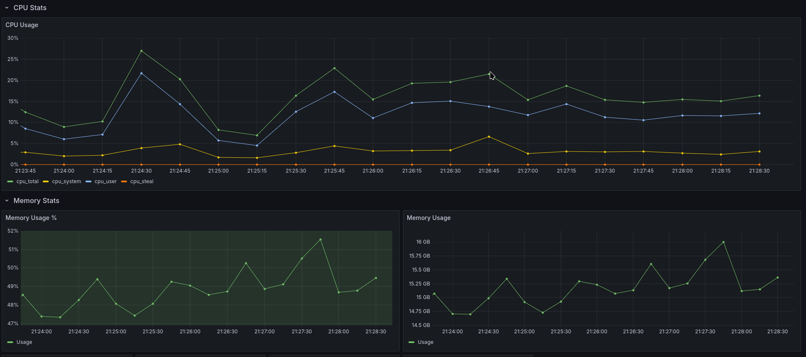
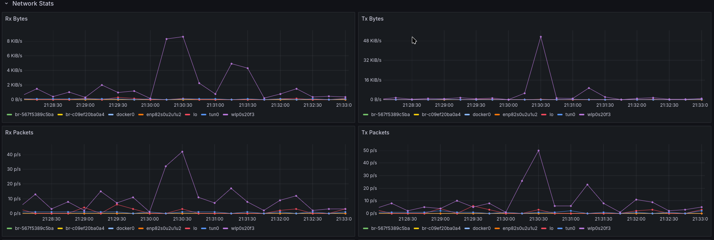
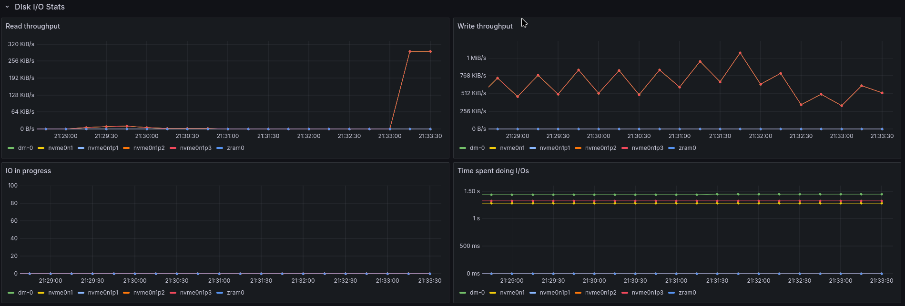

# **Metricly**

**Metricly** is a Go-based metrics collection framework designed to gather and expose system-level metrics, such as CPU usage, memory usage, disk I/O, network statistics, and more. These metrics are collected and exposed in Prometheus-compatible format for easy monitoring and visualization.




---

## **Features**
- **Extensible Collectors**:
  - CPU Usage
  - Disk I/O and Space Usage
  - Network Throughput
  - Memory Usage
- **Prometheus Integration**:
  - Exposes metrics in a format compatible with `Prometheus`.
- **Configurable**:
  - Customize collection intervals and server settings via YAML configuration or environment variables.
- **Podman-Compatible**:
  - Run Metricly as a containerized service.
- **Custom Logging**:
  - Logs incoming and outgoing API requests with support for multiple log levels (INFO, DEBUG, ERROR).
- **Metrics Visualization**
  - Provides an inbuilt `Grafana` dashboard to visualize all metrics.
---

## **Getting Started**

### **Prerequisites**
- **Go 1.22+**
- **Podman** (for containerized deployment)
- **Prometheus** (for metrics scraping)

---

### **Installation**

#### Clone the repository:
```bash
git clone https://github.com/yadneshk/metricly.git
cd metricly
```

#### Build the binary:
```bash
go build -o metricly cmd/collector/main.go
./metricly --config /path/to/config.yaml
```
OR
#### Use Makefile to build
```bash
make build
./build/metricly --config /path/to/config.yaml
```
OR
#### Use Makefile to build and run
```bash
make run CONFIG_FILE=/path/to/config.yaml
```
---

### **Usage**

#### **Configuration**
Metricly uses a YAML configuration file to specify server settings and collection intervals. It also supports overriding configuration with environment variables. The default config file is `/etc/metricly/config.yaml`.

**Sample `config.yaml`:**
```yaml
server:
  address: "0.0.0.0"
  port: "8080"
prometheus:
  address: "0.0.0.0"
  port: "9090"
interval: 10s
debug: false
```

**Setting configurations through environment variables:**

| **Env Variables**   |  **Default Values**     | **Description**             |
|-----------------------|-----------------------|-----------------------------|
| `SERVER_ADDRESS`      |  `0.0.0.0`            | Address for server          |
| `SERVER_PORT`         |   `8080`              | Listen, serve on this port  |
| `PROMETHEUS_ADDRESS`  |   `0.0.0.0`           | Prometheus IP address       |
| `PROMETHEUS_PORT`     |    `9090`             | Prometheus serving port     |
| `COLLECTION_INTERVAL` |    `10s`              | Collect metrics after interval |
| `DEBUG`               |    `true`             | Log level                   |
| `HOSTNAME`            |                       | If empty, `os.Hostname()`   |
| `PROC_CPU_STAT`       |    `/proc/stat`       | Source for CPU metrics      |
| `PROC_MEMORY_INFO`    | `/proc/meminfo`       | Source for Memory metrics   |
| `PROC_DISK_STATS`     |  `/proc/diskstats`    | Source for Disk I/O usage   |
| `PROC_DISK_MOUNTS`    |  `/proc/mounts`       | Source for Disk Space Usage |
| `PROC_NETWORK_DEV`    |  `/proc/net/dev`      | Source for Network metrics  |

---

#### **Podman Compose Deployment**
Make sure `podman-compose` is installed
```bash
pip install podman-compose==1.2.0
```

Run `podman compose up`
```bash
make run_compose_up
...
✔ Container metricly_prometheus  Started 
✔ Container metricly_metricly    Started
✔ Container metricly_grafana     Started
```

Check containers
```bash
podman ps
CONTAINER ID   IMAGE                    COMMAND                  CREATED         STATUS         PORTS     NAMES
b6f86fba674e   metricly-metricly        "./metricly --config…"   3 minutes ago   Up 3 minutes             metricly_metricly
7f97e165d514   grafana/grafana          "/run.sh"                4 minutes ago   Up 3 minutes             metricly_grafana
5d24779a1af3   prom/prometheus:latest   "/bin/prometheus --c…"   4 minutes ago   Up 3 minutes             metricly_prometheus
```

`Grafana` dashboard would be available at `http://127.0.0.1:3000`

Use `admin/admin` to login into dashboard. `Metricly` dashboard is preloaded only in this deployment approach.


To destroy all containers
```bash
make run_compose_down
```

**Run with Podman:**
```bash
podman build -t metricly .
podman run --rm -p 8080:8080 --name metricly \
-v ./config/config.yaml:/etc/metricly/config.yaml:ro \
-e HOSTNAME=${HOSTNAME} \
localhost/metricly:latest
```

---

### **Metrics Exposed**

| **Metric Name**                   | **Description**                        | **Unit**   | **Labels** |
|-----------------------------------|----------------------------------------|------------|------------|
| `cpu_total`                       | Total CPU usage                        |  percent   | `hostname` |
| `cpu_system`                      | Total system CPU usage                 |  percent   | `hostname` |
| `cpu_user`                        | Total user CPU usage                   |  percent   | `hostname` |
| `cpu_steal`                       | Total steal                            |  percent   | `hostname` |
| `memory_total_bytes`              | Total memory                           |  bytes     | `hostname` |
| `memory_available_bytes`          | Total available memory                 |  bytes     | `hostname` |
| `memory_free_bytes`               | Free memory                            |  bytes     | `hostname` |
| `memory_hugepages_free`           | Free hugepages                         |  count     | `hostname` |
| `memory_hugepages_total`          | Total hugepages                        |  count     | `hostname` |
| `memory_hugepages_rsvd`           | Reserved hugepages                     |  count     | `hostname` |
| `memory_hugepages_surp`           | Surplus hugepages                      |  count     | `hostname` |
| `network_rx_bytes`                | Bytes received                         |  bytes/s   | `interface`, `hostname` |
| `network_tx_bytes`                | Bytes transmitted                      |  bytes/s   |  `interface`, `hostname` |
| `network_rx_packets`              | Packets received                       |  packets/s | `interface`, `hostname` |
| `network_tx_packets`              | Packets transmitted                    |  packets/s | `interface`, `hostname` |
| `network_rx_drops`                | Packets droppped while receiving       | packets/s  | `interface`, `hostname` |
| `network_tx_drops`                | Packets droppped while transmitting    | packets/s  | `interface`, `hostname` |
| `network_rx_errors`               | Malformed packets while receiving      | packets/s  | `interface`, `hostname` |
| `network_tx_errors`               | Malformed packets while transmitting   | packets/s  | `interface`, `hostname` |
| `disk_available_bytes`            | Available Disk space                   | bytes      | `interface`, `hostname` |
| `disk_total_bytes`                | Total Disk Space                       | bytes      | `interface`, `hostname` |
| `disk_usage_percentage`           | Disk Usage                             | percent    | `interface`, `hostname` |
| `disk_used_bytes`                 | Disk Usage                             | bytes      | `interface`, `hostname` |
| `disk_io_in_progress`             | Current disk IO operations in progress | count      | `interface`, `hostname` |
| `disk_io_time_spent_seconds`      | Time spent on IO operations in seconds | milliseconds | `interface`, `hostname` |
| `disk_read_throughput_bytes`      | Disk read throughput in bytes          | bytes      | `interface`, `hostname` |
| `disk_write_throughput_bytes`     | Disk write throughput in bytes         | bytes      | `interface`, `hostname` |
| `disk_reads_completed_total`      | Total disk reads completed             | bytes      | `interface`, `hostname` |
| `disk_writes_completed_total`     | Total disk writes completed            | bytes      | `interface`, `hostname` |
| `disk_weighted_io_time_seconds`   | Weighted time spent on IO in seconds   | milliseconds | `interface`, `hostname` |

---

### **Development**

#### **Testing**
Run unit tests:
```bash
go test ./...
```

#### **Logging**
Metricly uses Go’s `log/slog` library for structured logging. Customize log levels by modifying the configuration.

---

### **Contributing**
Contributions are welcome! If you find a bug or want to add a feature:
1. Fork the repository.
2. Create a new branch (`git checkout -b feature-name`).
3. Commit your changes (`git commit -m "Add feature"`).
4. Push to your branch (`git push origin feature-name`).
5. Open a Pull Request.

---

### **Contact**
For questions or support, please create an issue or contact the maintainer at [yadnesh45@gmail.com](mailto:yadnesh45@gmail.com).

---
